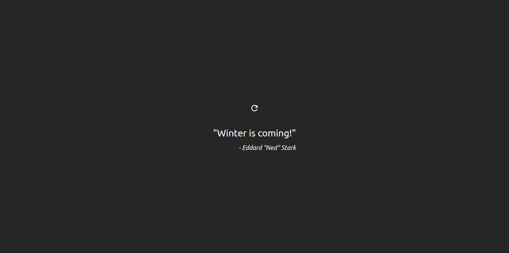

<h1 align="center">
    Game of Thrones Quotes
</h1>

<h4 align="center">
  A simple website project that shows a few Game of Thrones quotes.
</h4>

<p align="center">
  <a href="#technologies">Technologies</a>&nbsp;&nbsp;&nbsp;|&nbsp;&nbsp;&nbsp;
  <a href="#how-to-use">How To Use</a>
</p>



## Technologies

This project was developed to study the following technologies:

- [ReactJS](https://reactjs.org/)
- [Vite](https://vitejs.dev/)
- [TanStack](https://tanstack.com/)
- [Axios](https://axios-http.com/)
- [Tailwind CSS](https://tailwindcss.com/)
- [React-Icons](https://react-icons.github.io/react-icons/)

## How to use

To clone and run this application, you'll need [Git](https://git-scm.com), [Node.js v18.12.1](https://nodejs.org/en/) or higher + [npm v8.19.2](https://www.npmjs.com/) or higher installed on your computer and the [Game Of Thrones Quotes API](https://gameofthronesquotes.xyz/). From your command line:

```bash
# Clone this repository
$ git clone https://github.com/vitoroberto/got-quotes.git
# Go into the repository
$ cd got-quotes
# Install dependencies
$ npm install
# Run the app
$ npm run dev
```

---

README style inspired by [Luke Morales](https://github.com/lukemorales).
